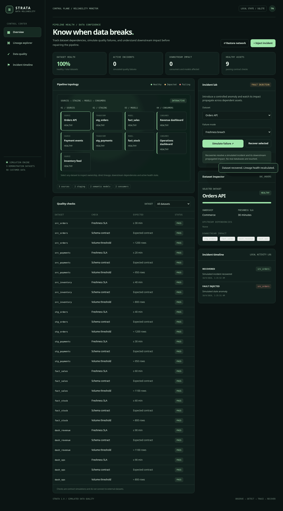

# STRATA — Data Reliability Control Plane

> Dataset freshness, pipeline health, lineage and incident simulator.

**Status:** functional demonstration / reference implementation, not a production service.

## Run locally

```bash
python -m venv .venv
source .venv/bin/activate
pip install -r requirements-dev.txt
uvicorn app.main:app --reload
# Open http://127.0.0.1:8000
pytest -q
```

Or run `docker compose up --build`.

## Features and API

Interactive browser interface served by the FastAPI backend, plus documented endpoints at `/docs`. The seed dataset is fictional or illustrative and labelled accordingly. No user accounts, real-time guarantees, routing directions, or operational decisions.


## What actually works

- Nine-node lineage explorer, ownership and data contracts.
- Dataset freshness, schema and volume check registry.
- Inject a simulated anomaly and trace its downstream impact.
- Recover one dataset or reset the simulated network.
- SQLite-persisted incident lifecycle and event log.

**API:** `GET /api/overview`, `/api/checks`, `/api/lineage/{node_id}`, `/api/incidents`; `POST /api/fault`, `/api/recover`, `/api/reset`.

[Lineage and architecture notes](docs/ARCHITECTURE.md).

## Architecture

```text
Browser (HTML/CSS/ES modules)
            │ JSON over HTTP
            ▼
    FastAPI endpoints
            │
            ▼
 Domain calculations + SQLite state (where applicable)
```

- Backend: Python, FastAPI, Pydantic validation.
- Frontend: dependency-free responsive JavaScript, CSS and inline SVG.
- Test suite: pytest with API/domain test coverage.
- Environment: `DATA_DIR` sets SQLite storage directory where used.
- Container: non-root Python slim image with `/health` healthcheck.

## Scope

This repository demonstrates an end-to-end engineering concept. It does not include authentication, multi-tenancy, production monitoring, external secrets infrastructure or cloud deployment by default. Real deployments need those controls, plus domain-specific validation, before accepting production data.

## UI preview



## License

MIT
